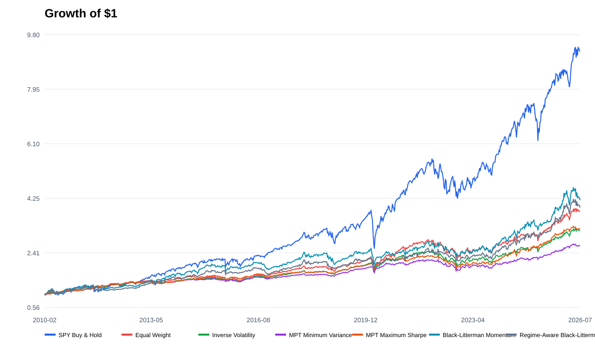
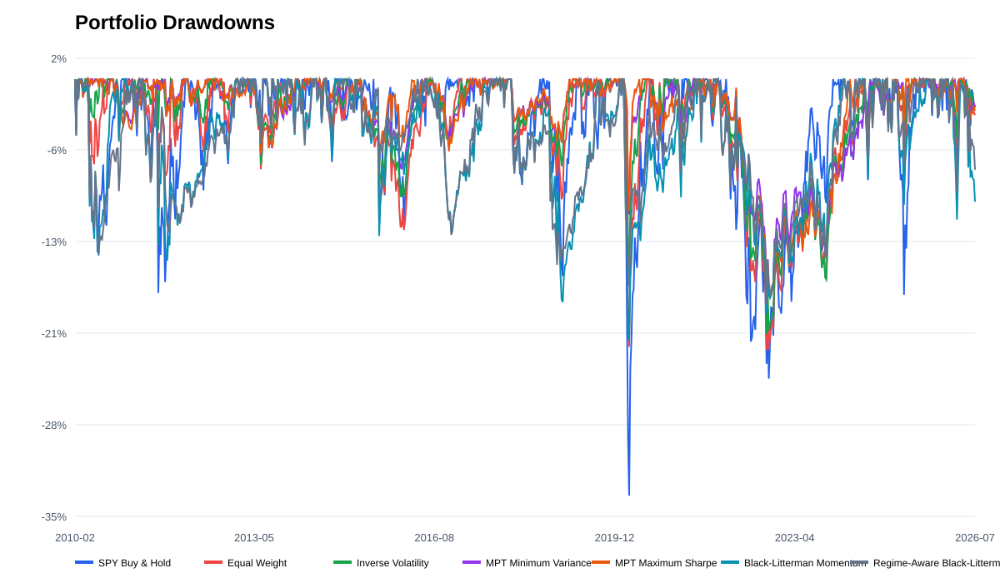
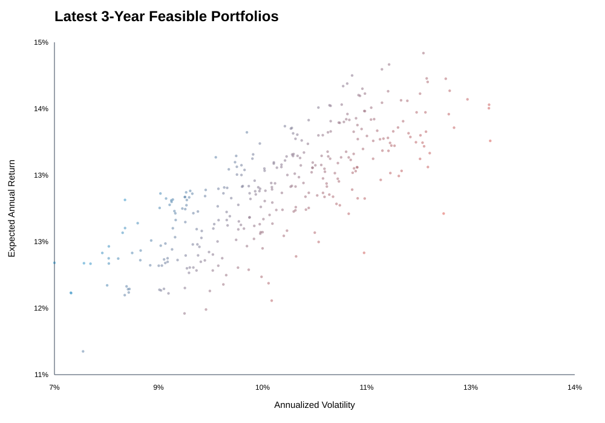

# Cross-Asset Portfolio Allocation

This project compares classical allocation methods on 11 cross-asset ETFs. It
implements Modern Portfolio Theory (MPT), Black-Litterman, momentum views and a
simple market-regime overlay in a monthly walk-forward backtest.

The main purpose is to show a complete quant research workflow:

- download and validate market data;
- estimate return and covariance with shrinkage;
- solve constrained portfolio weights;
- avoid look-ahead bias in signal timing;
- include turnover and transaction cost;
- compare Sharpe ratio, drawdown and stress scenarios;
- generate CSV, SVG and HTML reports.

## Strategies

1. SPY buy and hold
2. Equal weight
3. Inverse volatility
4. MPT minimum variance
5. MPT maximum Sharpe
6. Black-Litterman with 12-1 month momentum views
7. Regime-aware Black-Litterman

The asset universe is SPY, QQQ, IWM, EFA, EEM, TLT, IEF, LQD, GLD, DBC and
VNQ.

## Main design

- Data frequency: adjusted daily prices from Yahoo Finance
- Raw data period used in the current run: 2007-01-03 to 2026-07-28
- Estimation window: previous 756 trading days, about three years
- Rebalance frequency: monthly
- Signal timing: month-end signal starts from the next trading day
- Constraints: long-only and maximum 30% per ETF
- Transaction cost: 10 bps times one-way turnover
- Out-of-sample period in the current run: 2010-02-01 to 2026-07-28

The backtest is walk-forward, not one fixed train/test split. At every month-end,
the model uses only the previous 756 trading days. The next month is the new
out-of-sample period.

## Example result

The following numbers are from the current local dataset. They are research
results, not expected future returns.

| Strategy | CAGR | Volatility | Sharpe | Max drawdown |
|---|---:|---:|---:|---:|
| MPT Maximum Sharpe | 7.36% | 7.13% | 1.03 | -18.74% |
| MPT Minimum Variance | 6.09% | 6.43% | 0.95 | -18.62% |
| Inverse Volatility | 7.24% | 8.16% | 0.90 | -21.27% |
| SPY Buy & Hold | 14.46% | 17.10% | 0.88 | -33.72% |
| Equal Weight | 8.46% | 10.76% | 0.81 | -22.57% |
| Regime-Aware Black-Litterman | 8.69% | 12.20% | 0.74 | -19.70% |
| Black-Litterman Momentum | 9.09% | 13.34% | 0.72 | -23.63% |







One useful finding is that MPT improved risk-adjusted return in this sample, but
the Black-Litterman momentum models had high turnover. This is a real model
weakness and gives a clear next research direction: add turnover penalty, view
confidence calibration and macro data with correct release timing.

## Repository structure

```text
.
├── data/                         # Local Yahoo data, ignored by Git
├── docs/
│   └── methodology.md            # Formula and backtest explanation
├── results/                      # Small result summary for GitHub
├── scripts/
│   ├── download_data.py
│   └── run_analysis.py
├── src/cross_asset_portfolio/
│   ├── backtest.py               # Signals, walk-forward logic and metrics
│   ├── cli.py                    # Command line interface
│   ├── config.py                 # Assets and model parameters
│   ├── data.py                   # Yahoo download and data loading
│   ├── models.py                 # MPT and Black-Litterman models
│   └── reporting.py              # CSV, SVG and HTML output
└── tests/
```

## Installation

Python 3.10 or later is recommended.

```bash
python -m venv .venv
```

Windows PowerShell:

```powershell
.\.venv\Scripts\Activate.ps1
python -m pip install --upgrade pip
python -m pip install -e .
```

macOS or Linux:

```bash
source .venv/bin/activate
python -m pip install --upgrade pip
python -m pip install -e .
```

The basic installation uses the built-in NumPy projected-gradient optimizer. To
use CVXPY:

```bash
python -m pip install -e ".[optimization]"
```

## Run

Download Yahoo Finance data:

```bash
python scripts/download_data.py
```

Run the full backtest:

```bash
python scripts/run_analysis.py
```

The full report is saved to `analysis_outputs/report.html`.

Run unit tests:

```bash
python -m unittest discover -s tests -v
```

You can also use the installed commands:

```bash
portfolio-download
portfolio-backtest
```

## Important assumptions

- The current version uses 0% as the risk-free rate.
- Yahoo Finance data is not committed to this repository.
- Economic regime labels use only ETF price information.
- Taxes, bid-ask spread and market impact are not modeled.
- ETF survivorship and data-source quality should be checked before production
  use.

See [docs/methodology.md](docs/methodology.md) for the calculation details.

## License

The code is released under the MIT License. Yahoo Finance data is not covered
by this license. Please check the data provider terms before use.

This repository is for research and education only. It is not investment
advice.

